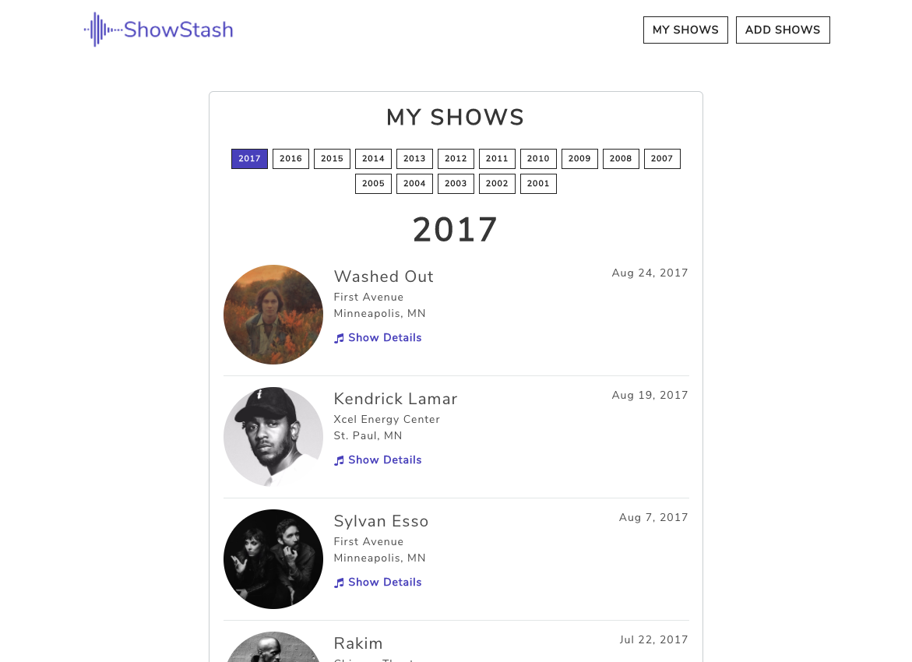
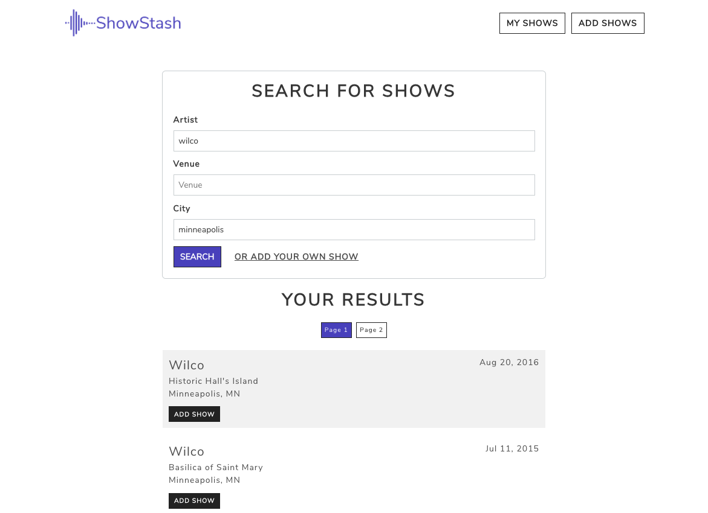

# ShowStash


ShowStash is a full-stack web application that tracks a user’s concert history. It allows users to search, add and view past concerts that they have attended.

[http://showstash.herokuapp.com/](http://showstash.herokuapp.com/)

## Built With

* PostgreSQL
* Express
* AngularJS
* Node.js
* Bulma
* Angular Toastr
* Font-Awesome
* FileStack
* setlist.fm and last.fm APIs

## Getting Started 

To get ShowStash up and running on your local machine for development and testing purposes. 
<!-- See deployment for notes on how to deploy the project on a live system. -->

### Prerequisites

- [Node.js](https://nodejs.org/en/)
- PostgreSQL
### Installing

Steps to get the development environment running.

```sql
CREATE TABLE users
( 
    id SERIAL PRIMARY KEY,
    email VARCHAR(80) NOT NULL UNIQUE,
    password VARCHAR(80) NOT NULL,
    first_name VARCHAR(80) NOT NULL,
    last_name VARCHAR(80) NOT NULL
);
CREATE TABLE users_shows
(
    id SERIAL PRIMARY KEY,
    version_id VARCHAR(80),
    artist VARCHAR(80) NOT NULL,
    mbid VARCHAR(80),
    show_date DATE NOT NULL,
    show_date INT,
    venue VARCHAR(120) NOT NULL,
    city VARCHAR(80) NOT NULL,
    state VARCHAR(10),
    notes VARCHAR(256),
    setlist TEXT[],
    image VARCHAR(256),
    user_id INT REFERENCES users
);
CREATE TABLE friends
(
    id SERIAL PRIMARY KEY,
    first_name VARCHAR(80) NOT NULL,
    last_name VARCHAR(80) NOT NULL,
    user_show INT REFERENCES users_shows
);
```

## Screen Shots





### Documentation

[Scope Document](https://docs.google.com/document/d/1ArQQmXNen83VzW5OeJpMc7EoyYDihfCzAjA75ECQ4EY/edit?usp=sharing)

### Completed Features

- [x] Year-by-year listing of concerts attended
- [x] Concert details including artist, date, venue, city, friends attended the concert with, show notes, and setlist if available
- [x] Manually add new shows to the list of concerts attended
- [x] Search past concerts to quickly add new shows to your concert history. Search powered by data from setlist.fm and last.fm
- [x] Upload your own artist avatar to enhance the visual aesthetics of your concert history

### Next Steps

- [ ] Upload your concert photos to a concert specific photo gallery.

<!-- ## Deployment

Add additional notes about how to deploy this on a live system -->

## Authors

* Sam Fortin
